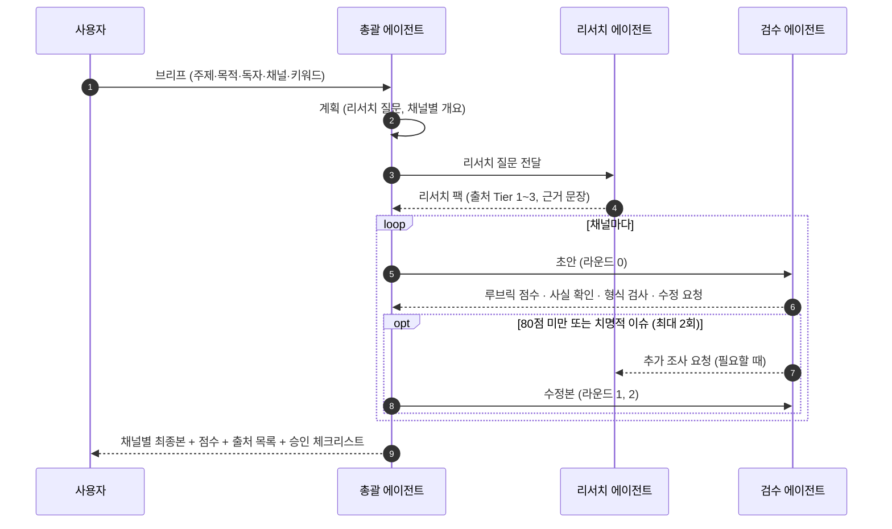

# INSIA 스마트에이전트


총괄·리서치·검수 에이전트 셋이 한 팀으로 **사업계획서**와 **네이버 블로그 · 링크드인 · 인스타그램** 콘텐츠를 만듭니다. 리서치 에이전트가 출처 등급을 붙여 근거를 모으고, 총괄 에이전트가 채널 형식에 맞춰 쓰고, 검수 에이전트가 루브릭과 사실 확인으로 점수를 매겨 되돌려 보냅니다. 기준을 넘길 때까지 최대 두 번 고치고, 마지막 게시는 사람이 합니다.

| | 에이전트 | 하는 일 |
|---|---|---|
|  | **총괄 에이전트** · 유자 디렉터 | 브리프를 받아 계획을 세우고, 리서치를 맡기고, 채널별 초안을 쓰고, 검수 의견을 반영해 최종본을 묶습니다. |
|  | **리서치 에이전트** · 돋보기 탐험가 | 한국어·영어로 웹을 검색해 공식 통계·공공기관 자료를 먼저 찾고, 주장마다 출처와 기준 시점을 붙입니다. |
|  | **검수 에이전트** · 꼼꼼 검수관 | 채널 루브릭으로 채점하고, 모든 수치를 리서치 자료와 대조하고, 형식 규칙을 코드로 검사해 수정 요청을 보냅니다. |

## 에이전트가 일하는 모습 보기

`web/`의 대시보드가 세 에이전트의 작업을 실시간으로 보여 줍니다. 활성화된 에이전트는 모션 영상으로 움직이고, 작업이 넘어갈 때마다 패킷이 에이전트 사이를 오가며, 채널 카드에 점수와 수정 라운드가 채워집니다. API 키가 없어도 실행 기록을 재생하는 데모 모드로 볼 수 있습니다.

```bash
pip install -e .
insia serve            # http://127.0.0.1:8765 에서 대시보드 열기 (API 키 없어도 됨)
```

- **데모 모드**: 페이지를 열면 실행 기록을 재생합니다. `web/demo/demo-run.json`(`insia run --record`로 녹화한 기록)이 있으면 그 파일을, 없으면 손으로 만든 예시 `web/demo/sample-trace.json`을 씁니다. 1×/2×/4× 속도, 일시정지, 구간 이동이 됩니다. 브라우저는 `file://` 페이지의 `fetch()`를 막으므로 `web/index.html`을 파일로 바로 열면 기록을 불러오지 못합니다. 아래 셋 중 하나로 여세요.
  - `insia serve`
  - 정적 서버: `cd web && python3 -m http.server 8000` 뒤 http://127.0.0.1:8000
  - 단일 페이지 빌드: `python scripts/build_artifact.py`로 만든 `dist/artifact/index.html`. 기록과 에셋 목록이 페이지 안에 들어 있어 파일로 열어도 재생됩니다.
- **라이브 모드**: `insia serve`로 열면 **새 실행** 버튼(브리프 폼)으로 작업을 시작하고, 이벤트가 SSE로 들어오는 대로 화면에 그립니다. API 자격 증명(`ANTHROPIC_API_KEY` 등)이 있으면 Claude API로 실제 실행하고, 없으면 모의 실행으로 같은 흐름을 보여 줍니다. 대시보드 API는 같은 주소에서 연 대시보드 페이지만 쓰도록 되어 있습니다.
- **3D로 보기**: 에이전트 카드의 3D 버튼을 누르면 카피바라 3D 모델(GLB)을 돌려 볼 수 있습니다. 뷰어 스크립트를 CDN에서 불러오므로 인터넷 연결이 필요합니다.

## 빠른 시작

### 1) 명령줄에서 실행

```bash
pip install -e .

# API 키 없이: 녹화된 샘플 실행을 재생 (모의 모드, --speed 0이면 기다리지 않고 바로 끝남)
insia run --brief examples/sample-run/brief.json --mode mock --speed 0

# 실제 실행: Claude API로 리서치(웹 검색)·작성·검수
export ANTHROPIC_API_KEY=sk-ant-...
insia run --topic "동네 베이커리 온라인 주문 서비스" \
  --goal "청년창업사관학교 신청 + 오픈 홍보" \
  --audience "30~40대 직장인" \
  --channels bizplan,naver_blog,linkedin,instagram \
  --keywords "베이커리 온라인 주문,동네 빵집"
```

결과는 `outputs/<run_id>/`에 채널별 최종본(`<channel>.md`), 검수 결과(`<channel>.review.json`), 리서치 자료(`research.json`), 이벤트 로그(`events.jsonl`)로 저장됩니다.

주요 옵션: `--mode auto|live|mock` (기본 auto: 자격 증명이 있으면 live), `--max-rounds 2` (최대 수정 횟수), `--pass-score 80` (통과 점수), `--record trace.json` (대시보드용 기록 저장), `--speed` (모의 모드 재생 속도).

모델은 기본 `claude-opus-5`이고 `INSIA_MODEL` 환경 변수로 바꿀 수 있습니다. 안전 분류기가 요청을 거절하면 서버 측 폴백(`fallbacks: "default"`)이 다른 모델로 이어서 처리하며, 설정으로 끌 수 있습니다.

### 2) Claude Code에서 쓰기

이 저장소를 Claude Code로 열면 `.claude/agents/`의 세 에이전트와 `.claude/skills/`의 슬래시 명령을 바로 쓸 수 있습니다. 이때 리서치는 Claude Code의 WebSearch·WebFetch로 합니다.

```bash
claude --agent orchestrator        # 메인 세션을 총괄 에이전트로 시작
```

| 명령 | 용도 |
|---|---|
| `/content-studio <주제>` | 한 브리프로 네 채널을 한 번에 (원 소스 멀티 유즈) |
| `/bizplan <아이템>` | 예비창업패키지 PSST 양식 사업계획서 초안 |
| `/naver-blog <주제>` | 검색 의도에 맞춘 네이버 블로그 글 |
| `/linkedin <주제>` | '더 보기' 전 두 줄 훅이 있는 링크드인 게시물 |
| `/instagram <주제>` | 7~10장 캐러셀 문구·비주얼 지시 + 캡션 |

작업 파일은 `outputs/<날짜>-<슬러그>/`에 쌓이고, 형식 검사는 `python -m insia_agents check <draft.json>`으로 누구나 같은 결과를 얻습니다.

## 파이프라인



## 채널별 기준

검수 점수는 100점 만점이고, **80점 이상이면서 치명적 이슈가 없어야** 통과합니다. `형식` 항목은 모델이 아니라 코드(`src/insia_agents/channels.py`)가 채점하므로 같은 초안은 언제나 같은 형식 점수를 받습니다.

| 채널 | 루브릭 (배점) | 코드가 검사하는 형식 |
|---|---|---|
| 사업계획서 | 문제인식 20 · 실현가능성 20 · 성장전략 20 · 팀 구성 10 · 근거·출처 20 · 형식 10 | PSST 4개 섹션 제목, 공백 제외 3,000~15,000자 |
| 네이버 블로그 | 검색 의도·키워드 20 · 경험·독창성 20 · 가독성 20 · 정확성·출처 20 · 마무리 10 · 형식 10 | 공백 제외 1,500~3,000자, 소제목 3개+, 이미지 자리 3개+, 태그 5~10개, 제목 40자 이내·메인 키워드 포함 |
| 링크드인 | 훅 25 · 인사이트 25 · 구조 15 · 정확성 15 · 대화 유도 10 · 형식 10 | 1,300~2,000자, 첫 두 줄 210자 이하, 해시태그 3~5개, 본문 링크 없음 |
| 인스타그램 | 훅 25 · 캐러셀 흐름 25 · 비주얼 지시 15 · 정확성 15 · 저장·공유 유도 10 · 형식 10 | 슬라이드 7~10장, 캡션 2,200자 이하, 캡션 첫 줄 125자 이하, 해시태그 3~5개 |

플랫폼 정책은 바뀝니다. 기준을 고칠 때는 `channels.py`의 숫자와 `src/insia_agents/prompts/channels/<채널>.md` 가이드를 **함께** 고치세요. 두 파일이 API 백엔드와 Claude Code 에이전트 양쪽의 단일 기준입니다.

## 폴더 구조

```
.claude/agents/          Claude Code 서브에이전트 (orchestrator, researcher, reviewer)
.claude/skills/          슬래시 명령 (/content-studio, /bizplan, /naver-blog, /linkedin, /instagram)
src/insia_agents/
  models.py              데이터 계약 (Brief, Plan, ResearchPack, Draft, Review …)
  channels.py            채널 루브릭과 결정적 형식 검사
  prompts/agents/        에이전트 시스템 프롬프트
  prompts/channels/      채널 가이드 (출력 형식, 루브릭, 체크리스트)
  backends/              Claude API 백엔드와 오프라인 모의 백엔드
  agents/ pipeline.py    에이전트 계층과 계획→리서치→작성→검수→수정 루프
  server.py cli.py       대시보드 서버(SSE)와 명령줄
web/                     비주얼 대시보드 (에셋: web/assets, 데모 기록: web/demo)
examples/sample-run/     샘플 브리프로 실제 리서치·작성·검수를 돌린 결과
docs/                    구조 설명, 이벤트 스키마, 3D 에셋 제작 기록
tests/                   오프라인 테스트 (pytest)
```

## 알아 둘 점

- **자동 게시는 하지 않습니다.** 결과물은 초안이고, 사람이 사실과 표현을 확인한 뒤 각 플랫폼에 직접 올립니다. 최종 요약에 승인 체크리스트가 함께 나옵니다.
- **근거 없는 수치는 쓰지 않습니다.** 모든 수치는 리서치 팩의 출처와 기준 시점을 따라가며, 검수 에이전트가 출처 없는 수치를 치명적 이슈로 처리합니다. 그래도 제출·게시 전에 원문 링크를 한 번 더 열어 보세요.
- **사업계획서의 팀 정보는 비워 둡니다.** `[대표자 성명]` 같은 자리표시를 신청자가 채웁니다. 정부지원사업은 대필과 허위 기재를 금지하므로 최종 문장은 신청자가 다듬어야 합니다.
- 캐릭터·아이콘·모션·3D 모델은 Higgsfield로 만들었습니다. 프롬프트와 제작 순서는 [docs/assets.md](docs/assets.md)에 있습니다.

## 개발

```bash
pip install -e . pytest
pytest                                 # 오프라인 테스트
python scripts/build_artifact.py       # 대시보드를 단일 페이지(dist/artifact)로 빌드
```

구조와 이벤트 형식은 [docs/architecture.md](docs/architecture.md), [docs/event-schema.md](docs/event-schema.md)를 보세요.
