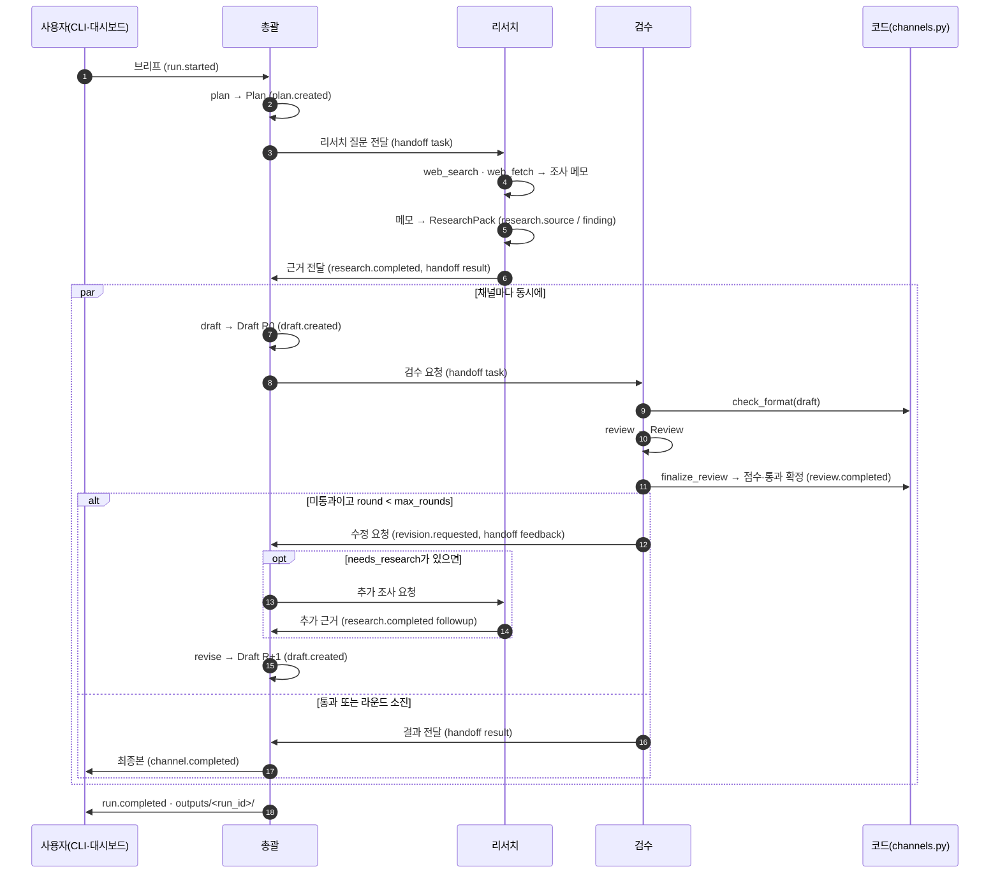

# 아키텍처

INSIA 스마트에이전트는 브리프 한 장을 받아 사업계획서와 네이버 블로그·링크드인·인스타그램 콘텐츠를 만드는 3-에이전트 시스템입니다. 같은 흐름을 두 가지로 돌릴 수 있습니다.

- **Claude Code**: `.claude/agents/*.md`와 `.claude/skills/*`로 대화하며 실행합니다. 웹 조사는 Claude Code의 WebSearch/WebFetch를 씁니다.
- **파이썬 패키지 `insia_agents`**: Anthropic API로 실행하는 CLI와 로컬 대시보드입니다. API 키가 없으면 mock 모드로 같은 이벤트 흐름을 오프라인에서 재생합니다.

이 문서는 파이썬 패키지의 구조를 설명합니다. 이벤트 형식은 [event-schema.md](event-schema.md)에 따로 정리했습니다.

## 세 에이전트

| id | 이름 | 하는 일 | 대시보드 캐릭터 |
|---|---|---|---|
| `orchestrator` | 총괄 에이전트 | 계획을 세우고, 리서치를 맡기고, 채널별 초안을 쓰고, 검수 의견을 반영해 고침 | 인디고 블레이저 카피바라 "유자 디렉터" |
| `researcher` | 리서치 에이전트 | 웹에서 근거를 찾아 출처 등급(Tier 1~3)을 붙인 리서치 팩을 만듦 | 틸 탐험 조끼 카피바라 "돋보기 탐험가" |
| `reviewer` | 검수 에이전트 | 루브릭 채점, 리서치 팩 대조 사실 확인, 수정 요청 | 코랄 카디건 카피바라 "꼼꼼 검수관" |

대시보드의 에이전트는 모두 3D 카피바라 캐릭터(이미지·루프 영상·GLB 모델)로 나오고, 에셋 경로는 `web/assets/manifest.json`에 있습니다.

## 구성 요소

```text
src/insia_agents/
  models.py          데이터 계약 (Brief, Plan, ResearchPack, Draft, Review, RunResult …)
  channels.py        채널 루브릭, 결정적 형식 검사(check_format), finalize_review
  config.py          Settings(환경 변수 + CLI), 모드 결정(auto → live/mock)
  prompt_loader.py   prompts/agents/*.md, prompts/channels/*.md 로딩
  schema.py          pydantic 모델 → 구조화 출력용 strict JSON 스키마
  events.py          EventBus(스레드 안전, 재생 가능), RealClock / SimClock
  backends/
    base.py          Backend 프로토콜, 오류 타입, 리서치 팩 병합(merge_research)
    anthropic_backend.py   live: Claude API 호출
    mock_backend.py        mock: 녹화된 샘플 재생 또는 [데모] 템플릿
  agents/            orchestrator.py · researcher.py · reviewer.py — 백엔드 호출을 이벤트로 감싸는 층
  pipeline.py        계획 → 리서치 → 채널별 초안·검수·수정 루프, 러너(SimRunner/ThreadRunner)
  storage.py         outputs/<run_id>/ 저장
  server.py          표준 라이브러리 HTTP 서버: 정적 파일 + REST + SSE
  cli.py             insia run | serve | sample-brief | check
```

역할을 이렇게 나눈 이유는 하나입니다. **백엔드는 결과만 돌려주고, 이벤트는 에이전트 층이 낸다.** 그래서 live와 mock이 같은 종류, 같은 순서 규칙의 이벤트를 만들고, 대시보드는 둘을 구분하지 않고 그립니다. (live에서는 검색어와 원문 열람 상태가 검색하는 순간에 추가로 옵니다.)

## 실행 순서



## 파이프라인 루프

1. **계획** — 총괄이 `Plan`을 만듭니다: 전략 요약, 모든 채널이 공유할 핵심 메시지 3~5개, 리서치 질문 3~6개, 요청한 채널의 섹션 순서.
2. **리서치** — 리서치 에이전트가 질문에 답하는 `ResearchPack`을 만듭니다. 출처는 URL 기준으로 중복을 없애고 `s1…`, 근거는 `f1…`로 번호를 매깁니다. 모든 근거는 출처를 하나 이상 가리키며, 출처 없는 주장은 `gaps`로 옮겨집니다.
3. **채널 루프** — 요청한 채널마다 따로 돕니다.
   - 총괄이 첫 초안(R0)을 씁니다. 사실은 리서치 팩에 있는 것만 씁니다.
   - 검수 에이전트가 루브릭을 채점하고 사실을 대조합니다. 그다음 코드가 `finalize_review`로 결과를 확정합니다: `format` 항목은 `check_format` 통과 비율로 다시 계산하고, 점수를 배점 안으로 자르고, 100점 만점으로 환산합니다. **통과 = 점수 ≥ `pass_score`(기본 80) 그리고 critical 이슈 0개.**
   - 통과하지 못했고 `round < max_rounds`(기본 2)면 수정 요청을 보냅니다. 검수가 `needs_research`를 남겼으면 리서치가 추가 조사를 하고, 새 근거는 기존 번호에 이어 붙습니다. 동시에 도는 채널들의 추가 조사는 잠금 안에서 합쳐져 번호가 겹치지 않습니다.
   - 총괄이 수정본(R+1)을 쓰고 `change_log`에 무엇을 고쳤는지 남깁니다. 다시 검수로 돌아갑니다.
   - 라운드가 끝나면 가장 좋은 초안(통과 여부 → 점수 → 나중 라운드 순)을 최종본으로 고릅니다. 라운드를 다 써도 통과하지 못하면 `passed: false`로 끝나고, 무한히 돌지 않습니다.
4. **저장** — `outputs/<run_id>/`에 `brief.json`, `plan.json`, `research.json`, `<channel>.md`(제목·해시태그 포함 최종본), `<channel>.review.json`, `result.json`, `events.jsonl`을 씁니다.

한 채널이 실패해도 다른 채널은 계속 갑니다. 검수·수정 단계에서 오류가 나면 그때까지 가장 좋은 초안으로 채널을 마치고, 첫 초안과 첫 검수까지 마치지 못한 채널만 `run.completed.errors`에 남습니다. 계획이나 리서치가 실패하거나 모든 채널이 실패하면 `run.failed`로 끝납니다.

## 모드

`--mode auto`(기본)는 Anthropic SDK와 같은 순서로 자격 증명을 찾습니다. `ANTHROPIC_API_KEY`·`ANTHROPIC_AUTH_TOKEN`, `ANTHROPIC_PROFILE`·`ANTHROPIC_CONFIG_DIR`, 워크로드 아이덴티티 연동 변수, `~/.config/anthropic`의 활성·기본 프로필(`ant auth login`으로 만든 것) 중 하나가 있으면 live, 없으면 mock으로 정하고 로그에 이유를 남깁니다. 빈 `~/.config/anthropic` 폴더는 자격 증명으로 치지 않습니다.

### live — `AnthropicBackend`

- `anthropic.Anthropic()` 인자 없는 클라이언트를 씁니다. 키를 코드에 넣지 않습니다.
- 모델은 `claude-opus-5`(환경 변수 `INSIA_MODEL`로 변경), `thinking={"type": "adaptive"}`, 역할별 `output_config.effort`(총괄 `high`, 리서치 `medium`, 검수 `high`; `INSIA_EFFORT_<ROLE>`로 변경).
- 모든 호출은 스트리밍하고 `get_final_message()`로 결과를 받습니다. `max_tokens`는 생각과 답변을 합친 상한이라 넉넉히 잡습니다(사업계획서 초안 64k, 나머지 16k~32k).
- 거절 대비: 기본으로 `client.beta.messages.stream`에 `betas=["server-side-fallback-2026-07-01"]`, `fallbacks="default"`를 붙여, 안전 분류기가 거절하면 API가 같은 요청을 권장 대체 모델로 다시 실행합니다. 대체 모델이 답했으면 `log`(warn)로 알립니다. `INSIA_FALLBACKS=0` 또는 `--no-fallbacks`로 끌 수 있습니다. 내용을 읽기 전에 항상 `stop_reason == "refusal"`부터 확인합니다.
- 구조화 출력: `schema.output_schema`가 pydantic 모델을 strict JSON 스키마(모든 객체 `additionalProperties: false`, 모든 속성 required, 지원하지 않는 키워드 제거)로 바꿔 `output_config.format`에 넣습니다. 프리필은 쓰지 않습니다.
- 프롬프트 캐싱: 에이전트 시스템 프롬프트와 채널 가이드 블록에 `cache_control`을 붙입니다. 날짜처럼 바뀌는 값은 사용자 메시지에 넣어 캐시가 깨지지 않게 합니다.
- 리서치는 두 번 호출합니다. 먼저 `web_search_20260209` + `web_fetch_20260209`(동적 필터링 내장이라 `code_execution`은 따로 선언하지 않음)로 조사 메모를 쓰게 하고, `pause_turn`이 오면 멈춘 어시스턴트 턴을 그대로 다시 보내 이어 갑니다(최대 5회). 이어서 도구 없는 구조화 호출로 메모와 검색·열람 결과를 `ResearchPack`으로 바꿉니다. 웹 검색 답변에는 인용(citation)이 붙는데, 인용과 구조화 출력은 함께 쓸 수 없어서 둘로 나눴습니다.
- API 오류는 타입이 있는 예외(`AuthError`, `RateLimitedError`, `APIConnectionFailed`, `ServerSideError`, `RequestRejectedError`, `RefusalError`, `OutputTruncatedError`, `InvalidOutputError`)로 바뀌고, 메시지는 대시보드에 그대로 띄울 수 있는 한국어입니다.

### mock — `MockBackend`

- 브리프 주제가 `examples/sample-run/brief.json`과 같으면 녹화된 실행을 재생합니다: `plan.json`, `research.json`, `drafts/<channel>.r<N>.json`, `reviews/<channel>.r<N>.json`, (있으면) `followups/<channel>.r<N>.json`(R N 검수가 요청한 추가 조사 결과, ResearchPack 형식)과 `meta.json`(`{"model": …}`). 요청한 라운드 파일이 없으면 가장 최근 라운드를 다시 씁니다. 녹화된 검수도 `finalize_review`를 거치므로 형식 점수는 늘 코드 기준입니다.
- 다른 주제면 브리프로 `[데모]` 템플릿 콘텐츠를 만듭니다. 구체 통계는 만들지 않고 `○○` 자리표시만 씁니다. 첫 초안 일부는 일부러 기준을 못 맞춥니다(링크드인 첫 두 줄 길이·해시태그 수, 블로그 소제목·이미지 자리, 사업계획서 TAM·SAM·SOM과 사업비 표). 수정본은 채널 형식을 모두 통과해 실제와 비슷한 검수 루프가 보입니다.
- 걸리는 시간은 가상 시계(`SimClock`)로 흘러갑니다. `speed`는 재생 배속입니다. 실제로 기다리는 시간 = 가상 초 ÷ `speed`(1이면 실제 시간, 2면 두 배 빠르게)이고, `speed 0`이면 기다리지 않아도 이벤트의 `t`는 현실적인 값을 가집니다.

### 러너

에이전트 단계는 제너레이터입니다. 이벤트를 내고, 백엔드를 부르고, 방금 한 일에 걸린 시뮬레이션 시간을 `yield`합니다.

- **SimRunner (mock)**: 가상 시간 기준의 작은 이산 사건 스케줄러입니다. 채널들이 가상 시간 순서로 섞여 진행되고, 같은 시각이면 채널 순서로 정해지므로 몇 번을 돌려도 같은 트레이스가 나옵니다.
- **ThreadRunner (live)**: 채널마다 스레드를 하나씩 써서 동시에 API를 부릅니다. `yield`한 시간은 무시하고 실제 시간이 흐릅니다.

## 대시보드가 이벤트를 쓰는 방법

`web/`의 대시보드("INSIA 에이전트 스튜디오")는 빌드 없이 도는 정적 페이지입니다.

- **데모 모드**: 페이지를 열면 `build_artifact.py`가 페이지에 넣은 기록(`<script id="insia-trace">`)을, 없으면 `demo/demo-run.json`을, 그것도 없으면 `demo/sample-trace.json`을 불러와 `t`에 맞춰 재생합니다. `insia run --record web/demo/demo-run.json`이 이 파일을 만듭니다. `/api/health`에 닿지 않으면(정적 서버로 띄웠거나 Artifact로 게시한 경우) 재생만 합니다. 브라우저는 `file://` 페이지의 `fetch()`를 막으므로 `web/index.html`을 파일로 바로 열면 기록을 불러오지 못합니다. `insia serve`, `web/`에서 띄운 `python3 -m http.server`, 또는 기록이 페이지 안에 들어 있는 `dist/artifact/index.html`(빌드 결과)로 여세요.
- **라이브 모드**: `insia serve`로 띄우면 브리프 폼을 `/api/sample-brief`로 채우고, `POST /api/runs`로 실행을 시작한 뒤 `EventSource('/api/runs/<id>/events')`로 이벤트를 받습니다. 종료 이벤트를 받으면 연결을 닫습니다.
- 두 모드 모두 같은 순수 리듀서 `applyEvent(state, event)`로 상태를 만들고 그립니다.
  - `agent.status` → 캐릭터의 상태 칩과 말풍선, 활성 캐릭터는 루프 영상 재생
  - `handoff` → 에이전트 사이 경로를 따라 움직이는 패킷과 라벨
  - `research.*` → 리서치 보드(출처 등급 배지, 근거 수, 빈틈)
  - `draft.created` · `review.*` · `revision.requested` · `channel.completed` → 채널 카드의 상태, 라운드, 점수 게이지, 형식 검사 칩, 최종본 보기
  - `run.completed` → 상단 요약(채널별 점수, 걸린 시간, 출처 수)
  - 모든 이벤트 → 타임라인(`t`를 mm:ss로 표시)

## 서버 API

| 메서드·경로 | 설명 |
|---|---|
| `GET /api/health` | `{mode, model, version, default_mode, live_available}` |
| `GET /api/sample-brief` | 샘플 브리프 |
| `POST /api/runs` | 브리프 JSON(+ 선택 `options: {mode, speed, max_rounds, pass_score}`, `speed`는 mock 재생 배속), `Content-Type: application/json`, 본문 64KB 이하 → `201 {run_id, mode, events_url, status_url}` |
| `GET /api/runs` | 최근 실행 목록 |
| `GET /api/runs/<id>` | 상태와 끝난 실행의 `RunResult` |
| `GET /api/runs/<id>/events` | SSE: 지난 이벤트 재생 → 새 이벤트, 15초마다 heartbeat, 종료 이벤트 뒤 연결 종료 |
| 그 밖의 `GET` | `web/` 정적 파일. `..`·인코딩된 `..`·역슬래시·숨김 파일·폴더 밖으로 나가는 심볼릭 링크를 막고, 영상용 Range 요청과 `.glb`(`model/gltf-binary`) MIME을 지원 |

기본 주소는 `127.0.0.1:8765`입니다. API는 같은 서버에서 연 대시보드 페이지가 쓰도록 만든 것입니다. `Host` 이름이 루프백(`127.0.0.1`, `localhost`, `[::1]`)이나 바인드 주소가 아닌 요청은 거절합니다(포트는 보지 않으므로 `ssh -L`·`docker -p` 포트 포워딩으로 열어도 됩니다). `POST`는 `Origin`이 요청한 주소와 같은(같은 출처) JSON 요청만 받습니다. 인증이 없으므로 외부에 열지 마세요.

## 설정

| 환경 변수 | 기본값 | 뜻 |
|---|---|---|
| `ANTHROPIC_API_KEY` / `ANTHROPIC_AUTH_TOKEN` | — | 있으면 auto 모드가 live가 됨 |
| `INSIA_MODE` | `auto` | `auto` · `live` · `mock` |
| `INSIA_MODEL` | `claude-opus-5` | live 모델 |
| `INSIA_EFFORT_ORCHESTRATOR` / `_RESEARCHER` / `_REVIEWER` | `high` / `medium` / `high` | `low`~`max` |
| `INSIA_FALLBACKS` | `1` | `0`이면 서버 측 거절 대체 모델을 끔 |
| `INSIA_OUT_DIR` | `outputs` | 결과 폴더 |
| `INSIA_WEB_DIR` · `INSIA_SAMPLE_DIR` · `INSIA_PROMPTS_DIR` | 저장소 안 경로 | 대시보드·샘플 실행·프롬프트 폴더 바꾸기 |
| `INSIA_TODAY` | 오늘(KST) | 프롬프트에 넣는 기준일 |
